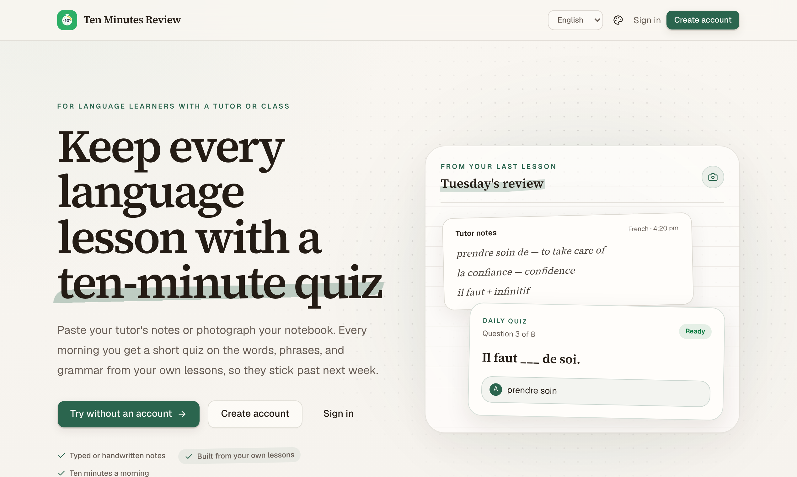
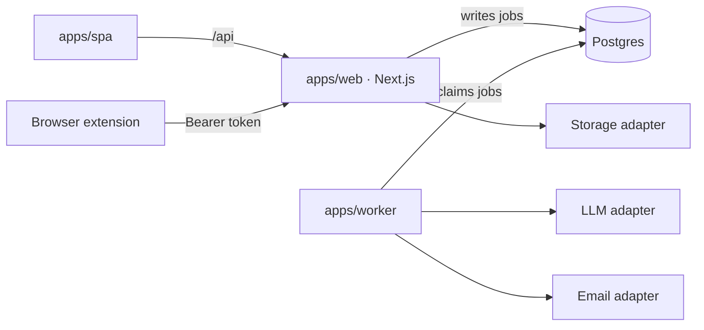
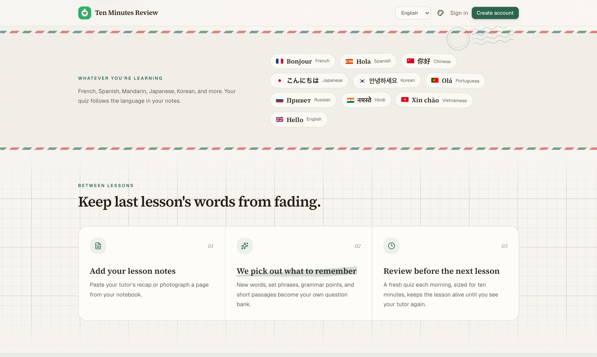
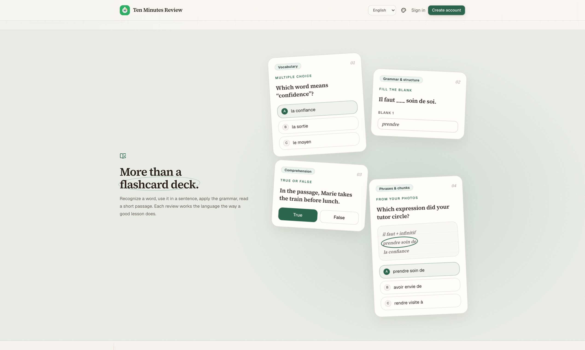
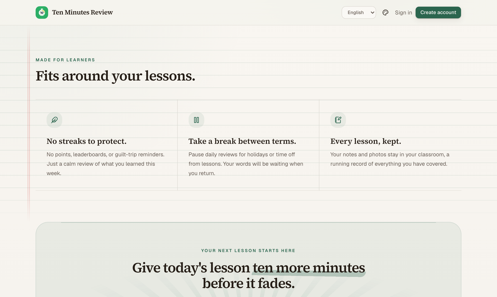

# Ten Minutes Review

Turns tutoring notes—typed text or photos of handwriting—into a fresh daily quiz that fits inside ten minutes.



**Status:** built and runnable locally. The default development setup uses deterministic mock AI, console email, and local image storage, so no vendor accounts are needed.

## Run it locally

Prerequisites: Node 22+, pnpm 10+, and Postgres 15+.

```sh
pnpm install
cp .env.example .env
pnpm db:migrate
pnpm dev:web
```

In a second terminal, start the signed-in web app, and in a third, the job worker:

```sh
pnpm dev:spa
pnpm dev:worker
```

Open [http://localhost:5173](http://localhost:5173) and sign up. Vite serves the signed-in screens and forwards the API and the other pages to Next on port 3000. The defaults in `.env.example` provide fixture extraction and quiz composition, print email to the worker log, and store uploaded images in `.uploads/`.

## Architecture



The web app never waits for the language model. It writes an `extract`, `compose`, or `send_email` job to Postgres and returns; the worker claims that work, retries it safely, and records the result. Answers and explanations remain server-side until an attempt is submitted.

| Layer | Responsibility |
|---|---|
| `apps/web` | Next.js 16: API routes, Auth.js sessions, and the landing, sign-in, and unsubscribe pages |
| `apps/spa` | Vite + React Router single-page app for every signed-in screen, served by the Next deployment |
| `apps/worker` | Extraction, quiz composition, scheduled delivery, retries, and health server |
| `packages/core` | Domain types, prompts, grading, quiz sizing, and localization |
| `packages/db` | Drizzle schema, migrations, and user-scoped repositories |
| `packages/email` | React Email templates, localized rendering, and browser previews |
| `packages/ui` | Shared shadcn components and the global stylesheet |

## The learning loop

One lesson becomes a reusable memory instead of a one-off worksheet.



1. **Capture:** paste a lesson recap or photograph handwritten notes.
2. **Distill:** the worker extracts reusable vocabulary, phrases, grammar, ideas, and comprehension passages.
3. **Review:** each quiz favors recent material while mixing in light retests from the question bank.
4. **Remember:** submission reveals answers and explanations; attempt history is retained and retakes reshuffle multiple-choice options.



## What the product does

1. A learner creates a classroom and adds typed notes or handwritten pages.
2. The worker extracts vocabulary, phrases, grammar, ideas, and comprehension passages into a question bank.
3. Each morning—or on demand—the worker composes a new quiz from recent material and light retests.
4. The learner answers on the web or reads the questions inline in email; submitted attempts retain scores, timing, answers, and explanations.

The interface and transactional email support English, French, and Chinese. Quiz content stays in the language being studied, with eleven target languages supported.



## Providers

Each external service sits behind a single adapter selected from the root `.env`.

| Concern | Local default | Production option |
|---|---|---|
| Language model | `LLM_PROVIDER=mock` | `deepseek` |
| Email | `EMAIL_PROVIDER=console` | `resend` or `brevo` |
| Image storage | `STORAGE_PROVIDER=local` | `vercel` |
| Database | Local Postgres | Neon Postgres |

Copy `.env.example`, keep the defaults for local work, and add provider credentials only when switching an adapter to a real service.

## Browser extension

`apps/extension` holds a Chrome/Firefox extension — select text on any page, right-click, save it as a note. Build and load it unpacked:

```sh
pnpm build:extension
```

- Chrome: `chrome://extensions` → Developer mode → Load unpacked → `apps/extension/dist/chrome`
- Firefox: `about:debugging#/runtime/this-firefox` → Load Temporary Add-on → `apps/extension/dist/firefox/manifest.json`

Sign in from the popup with email + password, or paste a token from Account → API tokens (the path for Google-only accounts). The extension talks to the production site by default; for local development build with `EXT_API_ORIGIN=http://localhost:3000 pnpm build:extension`. See [`apps/extension/README.md`](apps/extension/README.md) for details.

## Project documents

The documents are the source of truth for product behavior and architecture.

| File | What it covers |
|---|---|
| [`docs/SCOPE.md`](docs/SCOPE.md) | Product definition, constraints, and locked decisions |
| [`docs/PROMPTS.md`](docs/PROMPTS.md) | Extraction and composition prompts plus response shapes |
| [`docs/TECHNICAL.md`](docs/TECHNICAL.md) | Architecture, data model, API surface, pipelines, and deployment |
| [`docs/FLOWS.md`](docs/FLOWS.md) | Screen-by-screen behavior |
| [`docs/TRIAL-RUN.md`](docs/TRIAL-RUN.md) | Field notes from the real tutoring session that validated the loop |
| [`docs/DEPLOY-AWS.md`](docs/DEPLOY-AWS.md) | Self-hosting on AWS: Lightsail and App Runner runbooks |
| [`docs/PLAN-B-STATUS.md`](docs/PLAN-B-STATUS.md) | Implementation record, verification evidence, and next steps for the AWS path |

## Useful commands

```sh
pnpm typecheck
pnpm test
pnpm --filter web lint
pnpm build
pnpm build:extension
pnpm dev:email
```

`pnpm dev:email` opens the localized React Email previews at [http://localhost:3001](http://localhost:3001).

## Deployment

- Deploy `apps/web` to Vercel with files outside its root directory included.
- Deploy the repository's `render.yaml` blueprint to Render for the worker.
- Give both services `DATABASE_URL`, `AUTH_SECRET`, `APP_URL`, and the selected provider credentials.
- Production lives at `https://tenminutesreview.study`. When `APP_URL` names that domain, pages on `ten-minutes-review.vercel.app` redirect to it and `/api` there keeps serving older extension builds and webhooks.
- Connect Vercel Blob for production image uploads and set the repository `WORKER_URL` variable for the morning keep-alive workflow.
- Self-host on AWS with Docker Compose: see [`docs/DEPLOY-AWS.md`](docs/DEPLOY-AWS.md).

Billing, referral rewards, tier enforcement, quiz-type selection, and full spaced repetition are modeled or specified but intentionally deferred. See [`docs/TECHNICAL.md`](docs/TECHNICAL.md#7-deferred) for the current boundary.
